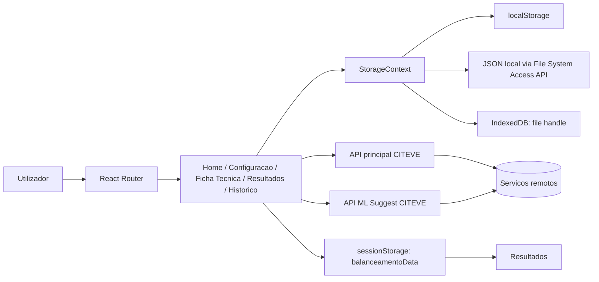

# PPS8 - Distribuicao de Operadores

## 1. Visao geral

O PPS8 e uma aplicacao web para apoiar o balanceamento de linhas de producao. Permite selecionar uma ficha tecnica, configurar operadores, maquinas, regras de distribuicao e layout da linha, executar um balanceamento automatico ou manual e analisar/exportar os resultados.

O utilizador principal e a equipa que planeia a distribuicao de operacoes por operadores e postos de trabalho. A aplicacao e uma SPA React/Vite; a persistencia local e feita no browser e a maior parte dos calculos de producao e dados tecnicos e obtida de APIs CITEVE externas.

Estado observado no repositorio: aplicacao funcional em desenvolvimento, com dados mock para arranque e integracao com APIs de desenvolvimento. Nao existe backend, base de dados ou suite de testes neste repositorio.

## 2. Stack tecnologica

| Tecnologia | Utilizacao |
| --- | --- |
| TypeScript e JavaScript | Codigo da aplicacao, tipos de dominio e configuracao da API. |
| React 18 | Componentes e ciclo de vida da interface. |
| React Router 7 | Routing no browser (`src/app/routes.ts`). |
| Vite 6 | Servidor de desenvolvimento e build. |
| Tailwind CSS 4 | Estilos utilitarios, integrado pelo plugin Vite. |
| Radix UI | Primitivas acessiveis usadas pelos componentes UI. |
| Material UI / Emotion | Componentes e icones usados em partes da interface. |
| Axios | Comunicacao HTTP com as APIs externas. |
| Recharts | Graficos de resultados e historico. |
| `xlsx` | Exportacao de dados para Excel. |
| `react-dnd` | Interacoes de arrastar e largar em componentes de configuracao/layout. |
| File System Access API | Criacao, abertura e gravacao de ficheiros JSON de sessao, quando suportada pelo browser. |
| IndexedDB | Guarda o handle do ficheiro de sessao para reconexao futura (`fileStorageDB.ts`). |
| Docker | Imagem de producao baseada em Node 20 Alpine. |

O `package.json` tambem inclui `motion`, `react-hook-form`, `react-day-picker`, `sonner`, `lucide-react`, `date-fns`, `embla-carousel-react`, `vaul` e varias primitivas Radix. A lista completa de versoes esta em `PPS8-distribuicao-operadores/PPS8-distribuicao-operadores/package.json`.

## 3. Como executar o projeto

### Requisitos

- Node.js 20 ou compativel com as dependencias instaladas. O Dockerfile usa Node 20 Alpine.
- npm. O projeto inclui `package-lock.json` dentro da pasta da aplicacao.
- Browser moderno. A funcionalidade de ficheiro JSON depende da File System Access API; sem ela, a aplicacao usa apenas `localStorage`.
- Para as funcionalidades ligadas ao servidor: acesso de rede aos endpoints CITEVE definidos em `src/app/config.js`.
- Docker e Docker Compose apenas se for usada a execucao por contentor.

Nao e necessario configurar uma base de dados local segundo o repositorio.

### Instalacao

Executar na pasta da aplicacao:

```text
cd PPS8-distribuicao-operadores/PPS8-distribuicao-operadores
npm ci
```

O README tambem indica `npm i`; `npm ci` e a opcao reprodutivel suportada pelo lockfile e pelo Dockerfile.

### Configuracao

Nao existe `.env.example` nem outro ficheiro de secrets no repositorio. As variaveis Vite opcionais sao:

- `VITE_API_BASE_URL`
- `VITE_ML_SUGGEST_API_BASE_URL`

Em ambiente de browser, `src/app/config.js` escolhe a URL com base no hostname: `localhost` usa a API local `http://dev.citeve.pt:7860/api`; `dev.citeve.pt` e os hosts IP observados usam a API de desenvolvimento; outros hostnames tambem caem na API de desenvolvimento. As variaveis Vite sao lidas para o contexto sem browser e para a API ML; a selecao por hostname da API principal tem precedencia no browser.

Nao foram encontrados secrets, credenciais, autenticacao ou configuracoes de base de dados no repositorio.

### Base de dados

Nao existe schema, migration, seed ou cliente de base de dados local. Os dados de sessao sao guardados no browser:

- `localStorage` com a chave `balanceamento_sessao_v2`;
- chaves legadas `balanceamento_estado_v1` e `balanceamento_historico`, usadas para migracao;
- `sessionStorage` com a chave `balanceamentoData` para transportar resultados da Home para Resultados;
- IndexedDB para guardar o handle do ficheiro JSON ligado.

Os dados remotos de fichas tecnicas, polivalencia e historico pertencem aos servicos externos; o schema do servidor nao esta neste repositorio.

### Executar em desenvolvimento

```text
cd PPS8-distribuicao-operadores/PPS8-distribuicao-operadores
npm run dev
```

O Vite esta configurado na porta `3000` e com `strictPort: true`. A URL concreta apresentada pelo Vite deve ser usada para abrir a aplicacao.

### Build

```text
cd PPS8-distribuicao-operadores/PPS8-distribuicao-operadores
npm run build
```

O output e gerado por Vite em `dist/` (gerado, nao documentado na arvore abaixo).

### Executar em producao

Localmente, depois da build:

```text
npm run preview -- --host 0.0.0.0 --port 3000
```

O Dockerfile executa exatamente esse fluxo no contentor: instala com `npm ci`, faz `npm run build` e inicia `npm run preview` na porta 3000.

```text
cd PPS8-distribuicao-operadores/PPS8-distribuicao-operadores
docker compose up --build
```

O `docker-compose.yml` publica `3000:3000`, usa o contentor `pps8-operators-webapp` e declara a rede externa `common_network`. Essa rede tem de existir no ambiente Docker; o repositorio nao a cria.

Nao foi possivel determinar atraves do repositorio o processo de deployment para um servidor real.

### Testes e verificacoes

O `package.json` so define os scripts `dev`, `build` e `preview`. Nao ha script de testes, lint ou typecheck, nem ficheiros de testes detetados. A verificacao disponivel e:

```text
npm run build
```

## 4. Como operar o projeto

1. Abrir a aplicacao na raiz `/`.
2. Selecionar ou criar uma ficha tecnica. A lista de familias e fichas vem da API, embora existam dados mock locais para operadores e maquinas.
3. Em **Configuracao**, consultar/editar operadores, OLE, competencias, maquinas e catalogos de polivalencia.
4. Na Home, escolher a unidade, ficha tecnica e possibilidade de distribuicao.
5. Selecionar operadores quando o modo o exige, configurar parametros e, no modo manual, atribuir operacoes.
6. Executar o balanceamento. Dependendo da possibilidade, a Home chama um endpoint remoto ou usa `calcularBalanceamento` local.
7. Rever tabela, KPIs, visualizacao de fluxo, layout e waterfall na pagina de resultados ou no painel inline.
8. Ajustar layout/percentagens, guardar o historico e exportar XLSX/PDF quando as opcoes estiverem disponiveis.

### Sessao e ficheiro JSON

Ao arrancar, `StorageProvider` carrega primeiro o `localStorage`. Se o browser suportar File System Access API, tenta reconectar a um ficheiro conhecido via IndexedDB. O utilizador pode criar um novo ficheiro ou abrir um existente no modal de sessao do layout global. Cada `salvar` atualiza o `localStorage` e, se houver ficheiro ligado, escreve tambem no disco numa fila serializada.

Sem ficheiro ligado, a operacao continua com persistencia local. Ao trocar de browser, perfil ou dispositivo, esses dados nao acompanham o utilizador.

### Processos, jobs e logs

Nao existem workers, filas, cron jobs ou processos background no repositorio. As chamadas HTTP sao iniciadas pelos componentes React durante as interacoes do utilizador. O log local de operacoes retem no maximo os ultimos 100 registos.

## 5. Estrutura do projeto

```text
/
|- PROJECT.md
|- .vscode/
|- PPS8-distribuicao-operadores/
   `- PPS8-distribuicao-operadores/
      |- package.json
      |- package-lock.json
      |- vite.config.ts
      |- Dockerfile
      |- docker-compose.yml
      |- README.md
      |- guidelines/Guidelines.md
      |- src/
         |- main.tsx
         |- styles/
         |- imports/                 # Logos e assets importados
         |- assets/                  # Assets estaticos
         `- app/
            |- App.tsx
            |- routes.ts
            |- config.js
            |- types/index.ts
            |- data/mock.ts
            |- contexts/StorageContext.tsx
            |- utils/
            |- pages/
            `- components/
               |- ui/                 # wrappers/primitivas Radix e estilos base
               `- figma/
```

Pastas e ficheiros de procura rapida:

- `src/app/pages/Home.tsx`: orquestracao da selecao de ficha, configuracao, chamadas de balanceamento, resultados inline e exportacao.
- `src/app/pages/FichaTecnica.tsx`: CRUD/importacao de fichas e operacoes, familias, pools de candidatos e alarmes.
- `src/app/pages/Configuracao.tsx`: operadores, maquinas, OLE e vistas de polivalencia.
- `src/app/pages/Resultados.tsx`: leitura do resultado em `sessionStorage`, ajustes, historico e apresentacao detalhada.
- `src/app/pages/Historico.tsx`: sincronizacao, filtros, comparacao, detalhe e eliminacao do historico.
- `src/app/contexts/StorageContext.tsx`: estado persistente transversal.
- `src/app/components/`: componentes de dominio, tabelas, formularios, layout e visualizacoes.
- `src/app/utils/balanceamento.ts`: algoritmo local de distribuicao.
- `src/app/config.js`: selecao das bases URL externas.

## 6. Arquitetura



`main.tsx` monta `App`; `App` envolve o router com `StorageProvider`; `Layout` fornece navegacao e estado do ficheiro; as paginas e componentes usam `useStorage()` para ler/escrever dados locais.

Nao existe separacao backend/frontend dentro deste repositorio. A API externa recebe pedidos Axios e devolve dados que cada pagina normaliza para os tipos locais. A camada de adaptacao nao e uma camada independente: esta implementada principalmente dentro de `Home.tsx`, `FichaTecnica.tsx`, `Resultados.tsx`, `Historico.tsx` e componentes API.

## 7. Modelo de dados

### Estado local

`DadosSessao` em `src/app/contexts/StorageContext.tsx` contem:

- `operadores`: lista de `Operador`, com competencias por posicao, OLE historico e OLE por grupo;
- `maquinas`: lista de `Maquina`, com tipo, largura, setup, quantidade, operacoes compativeis e estado ativo;
- `configuracao`: grupo/ficha selecionados, operacoes manuais, layout e configuracao por unidade;
- `historico`: resultados de balanceamentos;
- `logOperacoes`: alteracoes locais de operadores, maquinas e operacoes.

Os contratos principais estao em `src/app/types/index.ts`: `Operacao`, `GrupoArtigo`/`Produto`, `ConfiguracaoDistribuicao`, `ConfiguracaoLayout`, `PostoTrabalho`, `ResultadosBalanceamento` e `HistoricoBalanceamento`.

### Relacoes importantes

- Um `GrupoArtigo`/produto tem uma lista ordenada de `Operacao`.
- Uma `Operacao` referencia tipos de maquina e pode ser critica ou agrupavel.
- Uma `Maquina` declara operacoes compativeis e quantidade disponivel.
- Um `Operador` relaciona-se com operacoes atraves de `competencias` e OLE.
- `DistribuicaoCarga` e `OperationAllocation` ligam operacoes a operadores no resultado.
- O historico guarda a configuracao e o resultado que originaram cada balanceamento.

### Modelo remoto

As entidades remotas incluem familias, fichas tecnicas/tasks, operacoes, colaboradores, matrizes de polivalencia, pools de candidatos, alocacoes e historico. Os nomes exatos de todas as colunas do servidor nao podem ser determinados porque o schema da API nao esta no repositorio.

## 8. Funcionalidades

### Selecao de ficha tecnica

**O que faz:** permite escolher familia e ficha tecnica/task para servir de base ao balanceamento.

**Onde esta implementada:** `src/app/pages/Home.tsx` e `src/app/pages/FichaTecnica.tsx`.

**Como funciona:** a Home carrega `/families/`, depois `/technical-sheets/family/{familyId}`, normaliza a resposta para `Produto` e guarda a selecao no estado local. A pagina de ficha tecnica permite criar, editar, importar e remover fichas e operacoes atraves da API.

**Dependencias:** API principal, `GrupoArtigo`, `Operacao`, `StorageContext` e endpoints de fichas.

**Como alterar:** alterar os mapeadores `mapApiTaskToProduto`/`mapApiOperation` e os handlers de CRUD em `FichaTecnica.tsx`; alterar a selecao e carregamento em `Home.tsx`.

### Configuracao de operadores, maquinas e polivalencia

**O que faz:** gere operadores, OLE, competencias, maquinas locais e informacao de cobertura/polivalencia.

**Onde esta implementada:** `Configuracao.tsx`, `CatalogoMaquinas.tsx`, `CatalogoMaquinasApi.tsx`, `MatrizPolivalencia.tsx`, `MatrizPolivalenciaGrupos.tsx` e `CoberturaGeral.tsx`.

**Como funciona:** alteracoes locais passam pelos helpers do `StorageContext` e geram `LogOperacao`. A criacao remota de colaborador chama `POST /collaborators/`. As matrizes e a cobertura fazem GET a endpoints de polivalencia e convertem as respostas para estruturas de tabela.

**Dependencias:** dados mock iniciais, API principal, OLE medio e matriz de polivalencia.

**Como alterar:** modificar `Configuracao.tsx` para regras de edicao e `StorageContext.tsx` para o contrato/persistencia; modificar os componentes de matriz para a apresentacao das respostas remotas.

### Configuracao do balanceamento

**O que faz:** configura horas de turno, produtividade, quantidade objetivo, numero de operadores, agrupamento de maquinas, limites de divisao e regras de layout.

**Onde esta implementada:** `Home.tsx`, `ConfiguracaoDistribuicao.tsx`, `ConfiguracaoLayout.tsx`, `LayoutConfigurador.tsx` e tipos em `types/index.ts`.

**Como funciona:** a Home mantem configuracao separada por unidade em `dadosUnidades`. A configuracao e passada aos componentes de formulario e ao payload da API. O layout suporta `linha` e `espinha`, postos, lados, distancia maxima, retrocesso e restricoes de proximidade.

**Como alterar:** alterar campos e validacoes em `ConfiguracaoDistribuicao.tsx`; alterar regras de postos e layout nos componentes de layout e no bloco de configuracao de `Home.tsx`.

### Balanceamento automatico e manual

**O que faz:** distribui operacoes pelos operadores conforme cinco possibilidades de configuracao, incluindo objetivo de producao, numero de operadores, modo manual e atribuicoes personalizadas.

**Onde esta implementada:** `Home.tsx`, `src/app/utils/balanceamento.ts`, `AtribuicaoManual.tsx` e `TabelaOperacoesManual.tsx`.

**Como funciona:** a Home prepara o payload com ficha, operacoes, candidatos, configuracao, layout e atribuicoes. Para os modos ligados ao servidor escolhe endpoints `allocate`, `allocate-objective`, `allocate-manual`, `allocate-custom` e variantes agrupadas/ideal. Para o caminho local usa `calcularBalanceamento` em `balanceamento.ts`, que ordena operacoes por sequencia e distribui carga pelos operadores disponiveis. A resposta e normalizada para `ResultadosBalanceamento`.

**Dependencias:** API principal para os modos remotos; OLE/competencias; operadores, maquinas e operacoes; layout.

**Como alterar:** alterar a selecao de endpoint e payload em `Home.tsx`; alterar apenas o fallback local em `balanceamento.ts`; alterar atribuicoes manuais em `AtribuicaoManual.tsx`/`TabelaOperacoesManual.tsx`.

### Analise e ajuste de resultados

**O que faz:** mostra distribuicao por operador, KPIs, tempos, ocupacao, perdas, layout e fluxo; permite recalcular e ajustar percentagens/posicoes.

**Onde esta implementada:** `Resultados.tsx`, `ResumoResultados.tsx`, `DashboardResultados.tsx`, `TabelaDistribuicao.tsx`, `VisualizadorFluxo.tsx` e `WaterfallOutputRate.tsx`.

**Como funciona:** a Home serializa o resultado em `sessionStorage` como `balanceamentoData` e navega para `/resultados`. `Resultados.tsx` reconstrui o modelo, tolera diferentes formatos numericos da API e chama `tasks/{task}/adjust` ou `adjust-ideal` para ajustes. O swap de postos usa `layout/swap-positions`. A visualizacao de fluxo calcula segmentos entre postos e operadores a partir das alocacoes.

**Como alterar:** mudar contratos de resultado em `types/index.ts`; adaptar normalizacao em `Resultados.tsx`/`Historico.tsx`; alterar a visualizacao no componente especializado correspondente.

### Historico e comparacao

**O que faz:** lista balanceamentos, filtra por metodo/operadores/ficha, compara registos, mostra detalhes e permite apagar um ou todos.

**Onde esta implementada:** `Historico.tsx`, `utils/historico.ts` e `StorageContext.tsx`.

**Como funciona:** a pagina carrega `/history/`, mapeia o formato remoto para `HistoricoBalanceamento` e persiste a lista localmente. O detalhe usa `/history/{id}` e reconstrui alocacoes, distribuicao e KPIs. Remocao chama DELETE remoto e atualiza a copia local.

**Como alterar:** endpoints e mapeamento estao no inicio/handlers de `Historico.tsx`; persistencia e migracoes estao em `utils/historico.ts` e `StorageContext.tsx`.

### Exportacao

**O que faz:** exporta dados do resultado para Excel e solicita PDF ao backend.

**Onde esta implementada:** handlers em `Home.tsx` e `Resultados.tsx`, com `xlsx` para exportacao XLSX.

**Como funciona:** XLSX e gerado no browser a partir das estruturas de tabela. PDF chama `POST /v2/tasks/{task}/export-pdf` com `responseType: blob` e descarrega a resposta.

## 9. API

Todas as rotas abaixo sao relativas a `API_BASE_URL`, salvo indicacao em contrario. Os handlers estao espalhados pelas paginas e componentes referidos.

| Grupo | Endpoints observados | Uso |
| --- | --- | --- |
| Familias | `GET /families/` | Lista familias para selecao/configuracao. |
| Fichas | `GET /technical-sheets/family/{familyId}`, `GET /technical-sheets/{task}/candidate-pools`, `POST /technical-sheets/`, `DELETE /technical-sheets/{task}` | Leitura, criacao, importacao e remocao de fichas. |
| Operacoes da ficha | `POST /technical-sheets/{task}/add-operation`, `DELETE /technical-sheets/{task}/remove-operation/{operation}`, `PUT /technical-sheets/{task}/update-operation` | CRUD de operacoes ligadas a ficha. |
| Colaboradores | `POST /collaborators/`, `GET /operations/collaborators/all` | Criacao e carregamento de operadores/candidatos. |
| Polivalencia | `GET /polyvalence/{collaborator}`, `GET /polyvalence/matrix/by-family`, `GET /polyvalence/coverage-overview`, `GET /polyvalence/candidates/average-ole` | Competencias, cobertura, familias e OLE medio. |
| Catalogo | `GET /technical-sheets/family/{familyId}` e endpoint de catalogo em `CatalogoMaquinasApi.tsx` | Operacoes e tipos de maquina disponiveis. |
| Alocacao | `POST /tasks/{task}/{allocate|allocate-grouped|allocate-ideal|allocate-grouped-ideal}`, variantes `allocate-objective`, `allocate-objective-ideal`, `allocate-manual`, `allocate-grouped-manual`, `allocate-custom` | Calcula a distribuicao. |
| Ajustes | `POST /tasks/{task}/adjust`, `adjust-ideal`, `layout/swap-positions` | Recalcula percentagens, atribuicoes e layout. |
| Historico | `GET /history/`, `GET /history/{id}`, `POST /history/`, `DELETE /history/{id}` | Sincroniza e gere resultados persistidos no servidor. |
| Exportacao | `POST /v2/tasks/{task}/export-pdf` | Produz PDF. |

Os inputs e outputs completos variam por modo e sao montados inline em `Home.tsx`. Os campos de resultado esperados incluem `operation_allocations`, `operator_times`, `operator_positions`, `kpis`, `machine_layout`, `operator_flow`, `machines_used`, `cycle_time_seconds` e `balance_loss`. Nao foi possivel determinar atraves do repositorio uma especificacao OpenAPI.

### API ML Suggest

`ML_SUGGEST_API_BASE_URL` e usada para:

- `POST /bottleneck/{task}/{waterfallEndpoint}` para waterfall/sugestao de gargalos;
- `GET /alarms/{produtoId}` para alarmes associados a uma ficha tecnica.

## 10. Frontend

O routing e definido em `src/app/routes.ts` com `createBrowserRouter` e `basename: import.meta.env.BASE_URL`:

| Rota | Pagina |
| --- | --- |
| `/` | `Home` |
| `/ficha-tecnica` | `FichaTecnica` |
| `/configuracao` | `Configuracao` |
| `/historico` | `Historico` |
| `/resultados` | `Resultados` |

Todas as rotas sao filhas de `Layout`, que fornece navegacao, rodape e gestao do ficheiro de sessao.

Nao existe Redux, Zustand ou outro store externo. O estado transversal esta em React Context (`StorageContext`); estado de pagina fica em `useState`, e dados de resultados entre rotas usam `sessionStorage`.

O design system local esta em `src/app/components/ui/`, com wrappers Radix, Tailwind e estilos em `src/styles/`. Existem tambem componentes especificos de resultados, tabelas, layout, catalogos e seletores.

## 11. Backend

Nao ha backend neste projeto. O frontend funciona como cliente das APIs remotas. Por isso nao existem routes server-side, controllers, services, repositories, models ORM, middleware ou tratamento de erros centralizado. Cada pagina faz a chamada Axios, trata o erro localmente e mapeia a resposta para os tipos de UI.

## 12. Autenticacao e autorizacao

Nao foram encontrados login, sessao de utilizador, tokens, roles, permissions ou middleware de autorizacao no codigo. As chamadas Axios observadas nao mostram configuracao de headers de autenticacao. A protecao efetiva das APIs, se existir, nao e determinavel atraves deste repositorio.

## 13. Integracoes externas

### API principal CITEVE

Configurada em `src/app/config.js` e consumida via Axios. Fornece familias, fichas tecnicas, colaboradores, polivalencia, alocacoes, ajustes, historico e PDF. Se estiver indisponivel, os componentes mostram erro local; alguns caminhos continuam com mock/localStorage, mas as funcionalidades remotas nao funcionam.

### API ML Suggest CITEVE

Fornece alarmes e sugestoes de gargalo/waterfall. Falhas sao apresentadas como erro de carregamento no componente/pagina que iniciou a chamada.

### File System Access API e IndexedDB

Sao APIs do browser, nao servicos de rede. `fileStorageDB.ts` trata permissao, leitura/escrita do JSON e persistencia do handle. Sem suporte, a aplicacao indica `sem-suporte` e usa o armazenamento local.

Nao foram encontrados webhooks, filas, uploads para storage externo ou integracoes de email.

## 14. Jobs, workers e tarefas automaticas

Nao existem jobs, workers ou cron jobs. A unica tarefa assinalavel e a fila de escritas do `StorageContext`, que serializa gravacoes no ficheiro local para evitar escritas simultaneas.

## 15. Configuracao e variaveis de ambiente

| Variavel | Obrigatoria | Utilizacao |
| --- | --- | --- |
| `VITE_API_BASE_URL` | Nao, tem fallback | Base URL da API principal em contexto sem browser/configuracao por ambiente. |
| `VITE_ML_SUGGEST_API_BASE_URL` | Nao, tem fallback | Base URL da API de sugestoes ML. |
| `import.meta.env.BASE_URL` | Fornecida pelo Vite | Basename usado pelo router; a build esta configurada com base `/texpact-wp2-pps8-operators/`. |

Os valores default e a logica por hostname estao em `src/app/config.js`. Nao colocar secrets neste documento ou em variaveis publicas Vite.

## 16. Ficheiros importantes

| Ficheiro/pasta | Responsabilidade |
| --- | --- |
| `PPS8-distribuicao-operadores/PPS8-distribuicao-operadores/package.json` | Dependencias e scripts. |
| `.../vite.config.ts` | Base path, porta, plugins, alias e fallback de assets Figma. |
| `.../Dockerfile` / `.../docker-compose.yml` | Build e execucao em contentor. |
| `.../src/main.tsx` / `.../src/app/App.tsx` | Bootstrap da aplicacao e providers. |
| `.../src/app/routes.ts` | Rotas. |
| `.../src/app/config.js` | Bases URL externas. |
| `.../src/app/contexts/StorageContext.tsx` | Estado, persistencia, ficheiro JSON e logs. |
| `.../src/app/types/index.ts` | Tipos do dominio. |
| `.../src/app/data/mock.ts` | Operadores e maquinas iniciais. |
| `.../src/app/pages/Home.tsx` | Fluxo principal e balanceamento. |
| `.../src/app/pages/FichaTecnica.tsx` | Fichas e operacoes. |
| `.../src/app/pages/Configuracao.tsx` | Configuracao de dados e polivalencia. |
| `.../src/app/pages/Resultados.tsx` | Resultados e ajustes. |
| `.../src/app/pages/Historico.tsx` | Historico remoto/local. |
| `.../src/app/utils/balanceamento.ts` | Fallback de algoritmo local. |
| `.../src/app/utils/fileStorageDB.ts` | File System Access API e IndexedDB. |
| `.../src/app/components/VisualizadorFluxo.tsx` | Fluxo entre postos. |
| `.../src/app/components/TabelaDistribuicao.tsx` | Tabela de distribuicao. |

## 17. Fluxos importantes

### Calcular um balanceamento remoto

```text
Utilizador
  -> Home.tsx
  -> seleciona familia/ficha e configura unidade
  -> API: POST /tasks/{task}/{modo-de-allocate}
  -> normalizacao da resposta para ResultadosBalanceamento
  -> sessionStorage.balanceamentoData
  -> /resultados
  -> Dashboard/Tabela/Visualizador
```

O modo escolhido depende da possibilidade, objetivo, numero de operadores, atribuicao manual e agrupamento de maquinas. A resposta e convertida de segundos para minutos e de fracoes para percentagens quando necessario.

### Calcular em modo local

```text
Home.tsx
  -> operadores selecionados + operacoes + ConfiguracaoDistribuicao
  -> calcularBalanceamento() em utils/balanceamento.ts
  -> ResultadosBalanceamento local
  -> sessionStorage.balanceamentoData
  -> Resultados
```

Este caminho nao substitui os calculos remotos para todos os modos; e um fallback implementado no cliente.

### Persistir uma alteracao

```text
Componente
  -> useStorage().salvar(parcial)
  -> merge com dadosRef.current
  -> localStorage: balanceamento_sessao_v2
  -> se houver ficheiro: fila -> JSON em disco
```

### Guardar historico

```text
Resultados ou Home
  -> constroi payload com ficha/configuracao/resultados
  -> POST /history/
  -> atualiza historico local
  -> StorageContext salva localStorage e ficheiro ligado
```

## 18. Decisoes tecnicas importantes

- **Persistencia hibrida local:** o `StorageContext` usa `localStorage` para resposta imediata e um JSON escolhido pelo utilizador para copia em disco. O motivo e observavel nos comentarios e no fluxo de inicializacao; a escolha melhora portabilidade manual, mas depende de permissoes do browser.
- **Compatibilidade com respostas API variantes:** `Home`, `Resultados`, `Historico` e `FichaTecnica` procuram varios nomes de campo e formatos aninhados. Isto e facto do codigo; indica que o frontend precisa de tolerar respostas de formatos diferentes.
- **API remota para alocacao:** o algoritmo de producao principal esta exposto como endpoints externos, enquanto `balanceamento.ts` fornece um calculo local mais simples. O trade-off inferido e dependencia operacional da API para resultados completos.
- **Estado de resultado em `sessionStorage`:** permite navegar para uma rota de resultados sem passar um objeto enorme pela URL ou por estado global, mas o resultado pode desaparecer ao fechar a sessao do separador.
- **Base path fixa:** Vite usa `/texpact-wp2-pps8-operators/`, e o router usa `BASE_URL`; publicar noutro subpath exige rever esta configuracao.

## 19. Problemas conhecidos / limitacoes

- Nao ha testes automatizados, lint ou typecheck configurados no `package.json`.
- Nao ha backend nem schema da base de dados no repositorio; a disponibilidade e contrato das APIs externas sao dependencias nao versionadas aqui.
- As URLs default em `src/app/config.js` apontam para servicos CITEVE de desenvolvimento e usam HTTP, nao HTTPS.
- O deployment Docker depende de uma rede externa `common_network` que nao e criada pelo Compose.
- Os dados locais comecam a partir de `operadoresMock` e `maquinasMock` quando nao existe sessao guardada; isto nao e uma carga de producao a partir da API.
- A aplicacao nao tem autenticacao visivel no cliente. Nao e possivel concluir pelo repositorio se a infraestrutura externa adiciona protecao.
- `Home.tsx` e `FichaTecnica.tsx` concentram muita logica de UI, adaptacao API e orquestracao; alteracoes nesses ficheiros tem impacto transversal.
- Nao foi possivel determinar atraves do repositorio o contrato completo dos endpoints, politicas de backup dos dados remotos, observabilidade de producao ou pipeline CI/CD.

## 20. Guia rapido: "Onde mexo para...?"

| Quero... | Procurar em... |
| --- | --- |
| Alterar a pagina inicial ou o botao de calcular | `src/app/pages/Home.tsx` |
| Adicionar uma rota | `src/app/routes.ts` |
| Alterar a ficha tecnica ou operacoes | `src/app/pages/FichaTecnica.tsx` |
| Alterar operadores, OLE ou maquinas | `src/app/pages/Configuracao.tsx`, `StorageContext.tsx` |
| Alterar o algoritmo local | `src/app/utils/balanceamento.ts` |
| Alterar o payload de alocacao | `src/app/pages/Home.tsx` |
| Adicionar/modificar um endpoint de dados | handler Axios na pagina/componente de dominio correspondente |
| Alterar a base URL de uma API | `src/app/config.js` |
| Alterar a estrutura dos resultados | `src/app/types/index.ts`, `Resultados.tsx`, `Historico.tsx` |
| Alterar tabelas/KPIs | `TabelaDistribuicao.tsx`, `DashboardResultados.tsx`, `ResumoResultados.tsx` |
| Alterar o desenho do fluxo/layout | `VisualizadorFluxo.tsx`, `LayoutConfigurador.tsx`, `ConfiguracaoLayout.tsx` |
| Alterar o historico | `src/app/pages/Historico.tsx`, `src/app/utils/historico.ts` |
| Alterar persistencia local | `StorageContext.tsx`, `storage.ts`, `fileStorageDB.ts` |
| Alterar exportacao XLSX/PDF | handlers de `Home.tsx`/`Resultados.tsx` e dependencia `xlsx` |
| Alterar estilo global | `src/styles/`, `default_shadcn_theme.css`, componentes em `components/ui/` |
| Alterar Docker ou porta de runtime | `Dockerfile`, `docker-compose.yml`, `vite.config.ts` |

## 21. Resumo tecnico

1. A aplicacao e uma SPA React 18/TypeScript compilada por Vite.
2. O router expoe Home, Ficha Tecnica, Configuracao, Resultados e Historico sob um layout comum.
3. O estado transversal vive em `StorageContext` e e persistido em `localStorage`, com opcao de ficheiro JSON local.
4. Fichas, polivalencia, alocacao, ajustes, historico e PDF dependem de APIs CITEVE externas consumidas por Axios.
5. A Home e o principal orquestrador do dominio e concentra a selecao de modo, payloads e normalizacao de resultados.
6. O resultado transita da Home para Resultados atraves de `sessionStorage`.
7. O modelo de dominio inclui operadores, competencias/OLE, maquinas, operacoes, configuracao de distribuicao, postos e alocacoes.
8. Nao existem backend, migrations, autenticacao, workers, testes ou CI/CD neste repositorio.
9. Antes de alterar o projeto, e essencial compreender os contratos externos e a persistencia local, porque nao estao cobertos por schemas ou testes locais.
